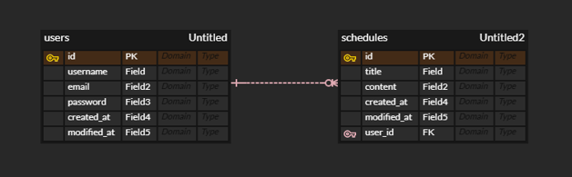

1. 일정 생성 
 - Method: POST
 - URL: /api/schedules

 ### Request Body
 ```json
 {
     "title": "일정 제목",
     "content": "일정 내용",
     "author": "작성자명",
     "password": "7777"
 }
 ```
   
 ### Response (201 Created)
 ```json
 {
  "id": 1,
  "title": "일정 제목",
  "content": "일정 내용",
  "author": "작성자명",
  "createdAt": "2026-02-11T10:00:00",
  "modifiedAt": "2026-02-11T10:00:00"
 }
 ```

2-1. 전체 일정 조회
  - Method: GET
  - URL: /api/schedules
  - Query Parameter: 
    - author: 작성자명
 
 ### Response (200 OK)
 ```json
 [
  {
   "id": 2,
   "title": "일정 제목",
   "content": "일정 내용",
   "author": "이지혜",
   "createdAt": "2026.02.11T10:00:00",
   "modifiedAt": "2026.02.11T10:00:00"
  }
 ]
 ```

2-2. 선택 일정 조회
  - Method: GET
  - URL: /api/schedules/{id}

 ### Response (200 OK)
 ```json
 {
  "id": 1,
  "title": "일정 제목",
  "content": "일정 내용",
  "author": "이지혜",
  "createdAt": "2026.02.11T10:00:00",
  "modifiedAt": "2026.02.11T10:00:00"
 }
 ```

3. 일정 수정
  - method: PUT
  - URL: /api/schedule/{id}

 ### Request Body
 ```json
 {
  "title": "일정 제목",
  "author": "이지혜",
  "password": "7777"
 }
 ```

 ### Response (200 OK)
 ```json
 {
  "id": 1,
  "title": "일정 제목",
  "content": "일정 내용",
  "author": "이지혜",
  "createdAt": "2026.02.11T10:00:00",
  "modifiedAt": "2026.02.11T10:00:00"
 }
 ```

4. 일정 삭제
 - Method: DELETE
 - URL: /api/schedules/{id}

 ### Request Body
 ```json
 {
  "password": "7777"
 }
 ```

 ### Response (200 OK)
 ```json
 {
  "message": "일정이 삭제 되었습니다."
 }
 ```

ERD


 


